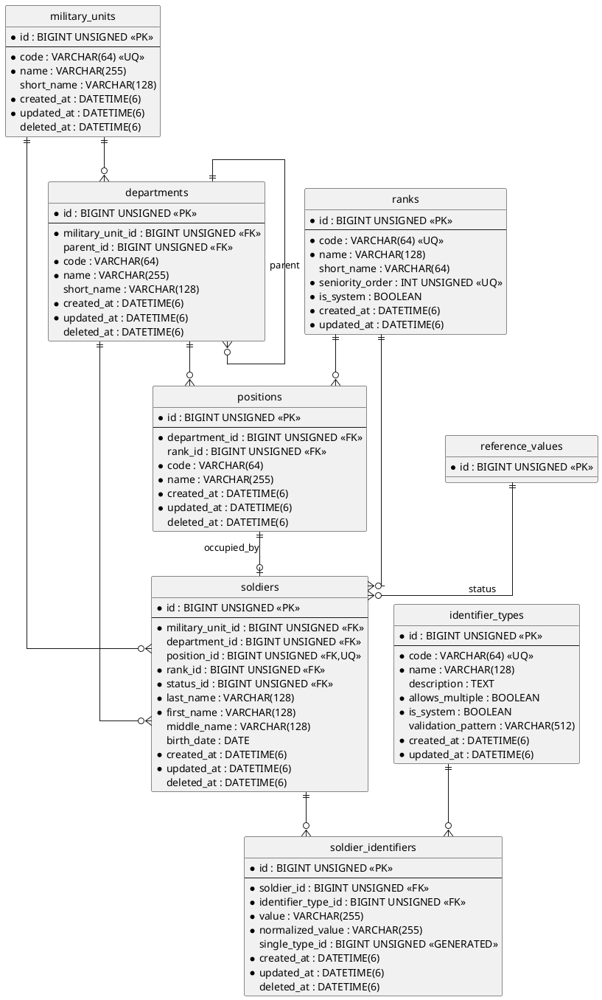

# ERD-020: Organization

## 1. Статус и назначение

Документ определяет логическую и физическую модель данных домена `Organization` системы АСУ-ВЧ.

ERD является обязательным контрактом для последующей спецификации миграций, реализации репозиториев, доменных сервисов и интеграционных тестов.

Источники требований:

- `docs/ARCHITECTURE.md`;
- `docs/DATABASE.md`;
- `docs/NAMING.md`;
- `docs/domains/ORGANIZATION.md`;
- `docs/domains/ORGANIZATION-REVIEW.md`;
- `docs/erd/ERD-030-reference.md`;
- `docs/erd/ERD-010-security.md`.

## 2. Область модели

В ERD входят таблицы:

```text
military_units
departments
ranks
positions
soldiers
identifier_types
soldier_identifiers
```

Внешние зависимости:

```text
reference_values
users
```

Таблица `users` не принадлежит домену `Organization`. Связь направлена из `Security`: `users.soldier_id → soldiers.id`.

## 3. Общая диаграмма



## 4. Таблица `military_units`

### 4.1 Назначение

Хранит воинские части как корневые объекты организационной структуры.

### 4.2 Поля

| Поле | Тип | Null | Назначение |
|---|---|---:|---|
| `id` | BIGINT UNSIGNED AUTO_INCREMENT | нет | Первичный ключ |
| `code` | VARCHAR(64) | нет | Неизменяемый машинный код |
| `name` | VARCHAR(255) | нет | Официальное наименование |
| `short_name` | VARCHAR(128) | да | Сокращенное наименование |
| `created_at` | DATETIME(6) | нет | Время создания |
| `updated_at` | DATETIME(6) | нет | Время изменения |
| `deleted_at` | DATETIME(6) | да | Soft delete |

### 4.3 Ограничения

```text
pk_military_units
uq_military_units_code
idx_military_units_deleted_at
```

- `code` уникален глобально, включая soft-deleted записи.
- `code` нормализуется: trim, lowercase, ASCII.
- Код опубликованной части не изменяется и не переиспользуется.

## 5. Таблица `departments`

### 5.1 Назначение

Хранит иерархию подразделений внутри одной воинской части.

### 5.2 Поля

| Поле | Тип | Null | Назначение |
|---|---|---:|---|
| `id` | BIGINT UNSIGNED AUTO_INCREMENT | нет | Первичный ключ |
| `military_unit_id` | BIGINT UNSIGNED | нет | Воинская часть |
| `parent_id` | BIGINT UNSIGNED | да | Родительское подразделение |
| `code` | VARCHAR(64) | нет | Код в пределах части |
| `name` | VARCHAR(255) | нет | Полное наименование |
| `short_name` | VARCHAR(128) | да | Сокращенное наименование |
| `created_at` | DATETIME(6) | нет | Время создания |
| `updated_at` | DATETIME(6) | нет | Время изменения |
| `deleted_at` | DATETIME(6) | да | Soft delete |

### 5.3 Ограничения и индексы

```text
pk_departments
uq_departments_unit_code
idx_departments_parent_id
idx_departments_unit_parent
idx_departments_deleted_at
```

Уникальность:

```text
UNIQUE (military_unit_id, code)
```

Внешние ключи:

```text
fk_departments_military_unit_id_military_units
fk_departments_parent_id_departments
```

Все FK используют:

```text
ON DELETE RESTRICT
ON UPDATE RESTRICT
```

### 5.4 Иерархические инварианты

- `parent_id <> id`.
- Родитель и дочернее подразделение принадлежат одной воинской части.
- Циклы запрещены.
- Смена `military_unit_id` для подразделения с родителем, потомками, должностями или военнослужащими выполняется только специальной доменной операцией либо запрещается.

Проверка отсутствия циклов и принадлежности родителя той же части выполняется доменным сервисом. Для защиты от обхода прикладного слоя миграционная спецификация должна рассмотреть триггеры `BEFORE INSERT` и `BEFORE UPDATE`.

## 6. Таблица `ranks`

### 6.1 Назначение

Хранит управляемый каталог воинских званий с предметным порядком старшинства.

### 6.2 Поля

| Поле | Тип | Null | Назначение |
|---|---|---:|---|
| `id` | BIGINT UNSIGNED AUTO_INCREMENT | нет | Первичный ключ |
| `code` | VARCHAR(64) | нет | Неизменяемый машинный код |
| `name` | VARCHAR(128) | нет | Полное наименование |
| `short_name` | VARCHAR(64) | да | Сокращенное наименование |
| `seniority_order` | INT UNSIGNED | нет | Порядок старшинства |
| `is_system` | BOOLEAN/TINYINT(1) | нет | Системная запись |
| `created_at` | DATETIME(6) | нет | Время создания |
| `updated_at` | DATETIME(6) | нет | Время изменения |

### 6.3 Ограничения и индексы

```text
pk_ranks
uq_ranks_code
uq_ranks_seniority_order
```

- `code` и `seniority_order` уникальны.
- `code` хранится в lowercase ASCII.
- Опубликованные системные звания не удаляются физически.
- Изменение кода системного звания запрещено.

`deleted_at` отсутствует намеренно: каталог званий в v1 управляется миграциями, сидерами и специальными административными операциями.

## 7. Таблица `positions`

### 7.1 Назначение

Хранит штатные должности конкретных подразделений.

### 7.2 Поля

| Поле | Тип | Null | Назначение |
|---|---|---:|---|
| `id` | BIGINT UNSIGNED AUTO_INCREMENT | нет | Первичный ключ |
| `department_id` | BIGINT UNSIGNED | нет | Подразделение |
| `rank_id` | BIGINT UNSIGNED | да | Требуемое или рекомендуемое звание |
| `code` | VARCHAR(64) | нет | Код должности в подразделении |
| `name` | VARCHAR(255) | нет | Наименование должности |
| `created_at` | DATETIME(6) | нет | Время создания |
| `updated_at` | DATETIME(6) | нет | Время изменения |
| `deleted_at` | DATETIME(6) | да | Soft delete |

### 7.3 Ограничения и индексы

```text
pk_positions
uq_positions_department_code
idx_positions_department_id
idx_positions_rank_id
idx_positions_deleted_at
```

Уникальность:

```text
UNIQUE (department_id, code)
```

Внешние ключи:

```text
fk_positions_department_id_departments
fk_positions_rank_id_ranks
```

Все FK используют `RESTRICT` для удаления и обновления.

- Код нормализуется и не переиспользуется после soft delete.
- Soft-deleted должность не может назначаться военнослужащему.
- Удаление занятой должности запрещено доменным сервисом.

## 8. Таблица `soldiers`

### 8.1 Назначение

Хранит военнослужащих и их текущее организационное состояние.

### 8.2 Поля

| Поле | Тип | Null | Назначение |
|---|---|---:|---|
| `id` | BIGINT UNSIGNED AUTO_INCREMENT | нет | Первичный ключ |
| `military_unit_id` | BIGINT UNSIGNED | нет | Текущая воинская часть |
| `department_id` | BIGINT UNSIGNED | да | Текущее подразделение |
| `position_id` | BIGINT UNSIGNED | да | Текущая должность |
| `rank_id` | BIGINT UNSIGNED | нет | Текущее воинское звание |
| `status_id` | BIGINT UNSIGNED | нет | Текущий организационный статус |
| `last_name` | VARCHAR(128) | нет | Фамилия |
| `first_name` | VARCHAR(128) | нет | Имя |
| `middle_name` | VARCHAR(128) | да | Отчество или иная средняя часть имени |
| `birth_date` | DATE | да | Дата рождения |
| `created_at` | DATETIME(6) | нет | Время создания |
| `updated_at` | DATETIME(6) | нет | Время изменения |
| `deleted_at` | DATETIME(6) | да | Soft delete |

### 8.3 Решение по структуре ФИО

В v1 ФИО хранится структурированно в полях:

```text
last_name
first_name
middle_name
```

Единое поле `full_name` не хранится как источник истины. Отображаемое полное имя формируется прикладным слоем.

### 8.4 Ограничения и индексы

```text
pk_soldiers
uq_soldiers_position_id
idx_soldiers_military_unit_id
idx_soldiers_department_id
idx_soldiers_rank_id
idx_soldiers_status_id
idx_soldiers_name
idx_soldiers_deleted_at
```

Уникальность занятой должности обеспечивается:

```text
UNIQUE (position_id)
```

MySQL допускает несколько `NULL`, поэтому множество военнослужащих может не иметь должности, но одна ненулевая должность не может принадлежать двум военнослужащим.

### 8.5 Внешние ключи

```text
fk_soldiers_military_unit_id_military_units
fk_soldiers_department_id_departments
fk_soldiers_position_id_positions
fk_soldiers_rank_id_ranks
fk_soldiers_status_id_reference_values
```

Все FK используют:

```text
ON DELETE RESTRICT
ON UPDATE RESTRICT
```

### 8.6 Организационная согласованность

При наличии `position_id` обязательны следующие правила:

1. `department_id` не равен `NULL`.
2. Должность принадлежит `department_id` военнослужащего.
3. Подразделение принадлежит `military_unit_id` военнослужащего.
4. Должность, подразделение и военнослужащий не soft-deleted.

При наличии только `department_id` подразделение обязано принадлежать `military_unit_id` военнослужащего.

Эти межтабличные инварианты не могут быть надежно выражены обычными `CHECK`. Они обеспечиваются доменным сервисом и защитными триггерами базы данных, состав которых фиксируется в спецификации миграций.

### 8.7 Проверка статуса

`status_id` должен указывать на активное значение `reference_values`, принадлежащее утвержденной группе:

```text
soldier_status
```

Группа и ее начальные значения утверждаются отдельно в migration specification. Проверка принадлежности группе выполняется триггерами `BEFORE INSERT` и `BEFORE UPDATE`, аналогично принятому решению для `users.status_id`.

## 9. Таблица `identifier_types`

### 9.1 Назначение

Определяет виды идентификаторов военнослужащих и правила их использования.

### 9.2 Поля

| Поле | Тип | Null | Назначение |
|---|---|---:|---|
| `id` | BIGINT UNSIGNED AUTO_INCREMENT | нет | Первичный ключ |
| `code` | VARCHAR(64) | нет | Неизменяемый машинный код |
| `name` | VARCHAR(128) | нет | Наименование |
| `description` | TEXT | да | Описание |
| `allows_multiple` | BOOLEAN/TINYINT(1) | нет | Допустимо несколько значений на военнослужащего |
| `is_system` | BOOLEAN/TINYINT(1) | нет | Системный тип |
| `validation_pattern` | VARCHAR(512) | да | Прикладное правило формата |
| `created_at` | DATETIME(6) | нет | Время создания |
| `updated_at` | DATETIME(6) | нет | Время изменения |

### 9.3 Ограничения и индексы

```text
pk_identifier_types
uq_identifier_types_code
```

- `code` хранится в lowercase ASCII.
- Код опубликованного типа неизменяем.
- `validation_pattern` является конфигурацией прикладной валидации, а не SQL-выражением.
- Системные типы не удаляются физически.

`deleted_at` отсутствует намеренно: опубликованный тип сохраняется как часть системного контракта.

## 10. Таблица `soldier_identifiers`

### 10.1 Назначение

Хранит нормализованные идентификационные реквизиты военнослужащих.

### 10.2 Поля

| Поле | Тип | Null | Назначение |
|---|---|---:|---|
| `id` | BIGINT UNSIGNED AUTO_INCREMENT | нет | Первичный ключ |
| `soldier_id` | BIGINT UNSIGNED | нет | Военнослужащий |
| `identifier_type_id` | BIGINT UNSIGNED | нет | Тип идентификатора |
| `value` | VARCHAR(255) | нет | Отображаемое значение |
| `normalized_value` | VARCHAR(255) | нет | Нормализованное значение для сравнения |
| `single_type_id` | BIGINT UNSIGNED GENERATED ALWAYS | да | Ограничение одиночного типа |
| `created_at` | DATETIME(6) | нет | Время создания |
| `updated_at` | DATETIME(6) | нет | Время изменения |
| `deleted_at` | DATETIME(6) | да | Soft delete идентификатора |

### 10.3 Нормализация

Нормализация выполняется прикладным сервисом по стратегии конкретного типа. Минимальный общий этап:

- trim;
- Unicode normalization;
- удаление разрешенных разделителей, если это определено типом;
- приведение регистра, если идентификатор регистронезависим.

Оригинальное значение хранится в `value`, сравнение выполняется по `normalized_value`.

### 10.4 Ограничения и индексы

```text
pk_soldier_identifiers
uq_soldier_identifiers_type_value
uq_soldier_identifiers_single_type
idx_soldier_identifiers_soldier_id
idx_soldier_identifiers_type_id
idx_soldier_identifiers_deleted_at
```

Глобальная уникальность идентификатора:

```text
UNIQUE (identifier_type_id, normalized_value)
```

Уникальность сохраняется после soft delete: опубликованное значение не переиспользуется.

### 10.5 Ограничение одного значения для одиночных типов

Generated column:

```sql
CASE
    WHEN `deleted_at` IS NULL
         AND identifier type has allows_multiple = 0
    THEN `identifier_type_id`
    ELSE NULL
END
```

Прямое обращение generated column к другой таблице в MySQL невозможно. Поэтому окончательное физическое решение должно быть одним из двух:

1. Денормализованная колонка `is_multiple_allowed`, копируемая из типа и защищенная триггерами, после чего generated column строится только по текущей строке.
2. Два защитных триггера, проверяющих отсутствие второго активного значения для типа с `allows_multiple = 0`.

Для v1 утверждается второй вариант как более нормализованный: без дублирования `allows_multiple` в `soldier_identifiers`.

Предусматриваются триггеры:

```text
trg_soldier_identifiers_bi_validate_multiplicity
trg_soldier_identifiers_bu_validate_multiplicity
```

Следовательно, поле `single_type_id` на физическом уровне в v1 не создается; оно показано на концептуальной диаграмме как рассматривавшийся механизм и заменено триггерным инвариантом.

### 10.6 Внешние ключи

```text
fk_soldier_identifiers_soldier_id_soldiers
fk_soldier_identifiers_identifier_type_id_identifier_types
```

Все FK используют `RESTRICT` для удаления и обновления.

## 11. Soft delete и ссылочная целостность

Soft delete применяется к:

```text
military_units
departments
positions
soldiers
soldier_identifiers
```

Физическое удаление системных и опубликованных записей `ranks` и `identifier_types` запрещено обычными операциями.

Обычный внешний ключ не учитывает `deleted_at`. Поэтому доменные сервисы и защитные триггеры запрещают:

- назначение soft-deleted части;
- назначение soft-deleted подразделения;
- назначение soft-deleted должности;
- добавление идентификатора soft-deleted военнослужащему;
- логическое удаление занятой должности;
- логическое удаление подразделения с активными потомками, должностями или военнослужащими;
- логическое удаление части с активной структурой или военнослужащими.

## 12. Направление междоменных связей

Разрешенные ссылки:

```text
soldiers.status_id → reference_values.id
users.soldier_id → soldiers.id
```

Запрещено:

```text
soldiers.user_id
Organization → Security
```

Внешние домены ссылаются на военнослужащего только через `soldiers.id`.

## 13. Начальные справочные данные

Для работы домена требуется группа Reference:

```text
soldier_status
```

Минимальный набор кодов для обсуждения в migration specification:

```text
active
absent
suspended
dismissed
```

До утверждения спецификации миграций эти значения не считаются окончательно замороженными. Default-значение также определяется на следующем этапе.

Системные каталоги домена:

- начальные звания `ranks`;
- начальные типы идентификаторов `identifier_types`.

Полный каталог seed-данных фиксируется в `ORGANIZATION-MIGRATIONS.md`.

## 14. Обязательные индексы поиска

Для типовых запросов предусматриваются:

```text
idx_departments_unit_parent (military_unit_id, parent_id)
idx_positions_department_id (department_id)
idx_soldiers_name (last_name, first_name, middle_name)
idx_soldiers_unit_department (military_unit_id, department_id)
idx_soldiers_status_id (status_id)
idx_soldier_identifiers_soldier_id (soldier_id)
uq_soldier_identifiers_type_value (identifier_type_id, normalized_value)
```

Индексы должны подтверждаться реальными запросами и планами выполнения после реализации, но обязательный минимальный набор создается миграциями.

## 15. Инварианты, требующие триггеров

Спецификация миграций должна определить безопасные технические триггеры для:

1. Принадлежности `soldiers.status_id` группе `soldier_status`.
2. Согласованности `soldiers.military_unit_id`, `department_id` и `position_id`.
3. Запрета назначения soft-deleted организационных сущностей.
4. Принадлежности родительского подразделения той же части.
5. Ограничения множественности `soldier_identifiers`.

Проверка циклов и сложные операции перестройки дерева остаются ответственностью доменного сервиса. Возможность дополнительной триггерной защиты цикла должна быть отдельно оценена с учетом MySQL 8.4 и стоимости рекурсивных запросов.

Триггеры не реализуют бизнес-процессы, не создают связанные записи и не заменяют доменную валидацию.

## 16. Решения версии 1

Утверждаются следующие решения:

- текущее состояние военнослужащего хранится непосредственно в `soldiers`;
- история назначений и переводов отсутствует;
- одна должность может быть занята только одним военнослужащим;
- военнослужащий может занимать только одну должность;
- ФИО хранится структурированно;
- должность определяется через `position_id`, а не отдельную таблицу назначений;
- звания являются собственной сущностью домена;
- универсальные организационные статусы хранятся в Reference;
- идентификаторы вынесены из `soldiers`;
- каскадное удаление не используется;
- machine codes не переиспользуются после публикации.

## 17. Отложенные решения

За пределами v1 остаются:

- история должностей;
- история подразделений и переводов;
- история званий;
- штатное расписание с версиями;
- временное исполнение обязанностей;
- совместительство;
- множественная принадлежность к подразделениям;
- международная модель персональных имен;
- шифрование отдельных значений идентификаторов;
- отдельный поисковый индекс по транслитерации ФИО;
- closure table или materialized path для дерева подразделений.

## 18. Вопросы для ERD review

На следующем этапе необходимо подтвердить:

1. Достаточность полей `military_units` и `departments`.
2. Область уникальности кодов должностей.
3. Обязательность `rank_id` у военнослужащего.
4. Допустимость nullable `department_id`, `position_id` и `birth_date`.
5. Окончательный каталог `soldier_status`.
6. Окончательный seed-каталог званий.
7. Окончательный seed-каталог типов идентификаторов.
8. Состав защитных триггеров.
9. Необходимость soft delete для `soldier_identifiers`.
10. Правила маскирования чувствительных идентификаторов.

## 19. Критерий готовности

ERD считается готовой к migration specification после:

- успешного архитектурного ревью;
- закрытия вопросов раздела 18;
- утверждения таблиц, полей, связей и ограничений;
- подтверждения стратегии триггерной защиты;
- утверждения начальных системных данных.
