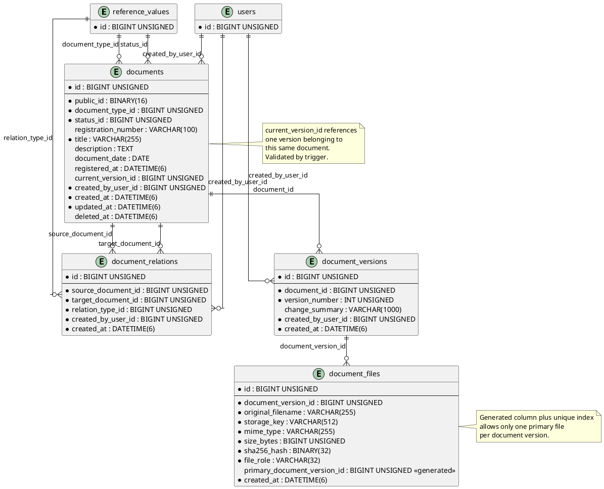

# ERD-050: Documents Domain

## Status

**ERD:** PROPOSED  
**Domain architecture:** APPROVED  
**Domain review:** APPROVED  
**Next step:** ERD REVIEW

## 1. Purpose

This document defines the logical and physical database model for the Documents domain.

The model implements:

- stable document identity;
- document lifecycle classification;
- immutable version history;
- immutable file metadata;
- one primary file per completed version;
- directed document relations;
- storage-provider independence;
- historical registration-number uniqueness;
- strict Reference group validation;
- RESTRICT foreign-key policy.

## 2. Tables

The domain owns:

- `documents`;
- `document_versions`;
- `document_files`;
- `document_relations`.

External dependencies:

- `reference_values`;
- `users`.

## 3. Relationship Overview

```text
reference_values (document_type)
          |
          v
      documents <------------------------------+
          |                                     |
          | 1:N                                 | source / target
          v                                     |
 document_versions                              |
          |                                     |
          | 1:N                                 |
          v                                     |
   document_files                               |
                                                |
 documents 1:N document_relations N:1 documents+

users -> documents.created_by_user_id
users -> document_versions.created_by_user_id
users -> document_relations.created_by_user_id
```

## 4. PlantUML



## 5. `documents`

### 5.1 Columns

| Column | Type | Null | Default | Description |
|---|---|---:|---|---|
| `id` | `BIGINT UNSIGNED` | NO | auto increment | Internal primary key |
| `public_id` | `BINARY(16)` | NO | none | UUID stored in binary form |
| `document_type_id` | `BIGINT UNSIGNED` | NO | none | Reference value from `document_type` |
| `status_id` | `BIGINT UNSIGNED` | NO | none | Reference value from `document_status` |
| `registration_number` | `VARCHAR(100)` | YES | `NULL` | Immutable registration number after registration |
| `title` | `VARCHAR(255)` | NO | none | Document title |
| `description` | `TEXT` | YES | `NULL` | Optional description |
| `document_date` | `DATE` | YES | `NULL` | Date stated on the document |
| `registered_at` | `DATETIME(6)` | YES | `NULL` | Registration timestamp |
| `current_version_id` | `BIGINT UNSIGNED` | YES | `NULL` | Current version; must belong to this document |
| `created_by_user_id` | `BIGINT UNSIGNED` | NO | none | User who created the record |
| `created_at` | `DATETIME(6)` | NO | `CURRENT_TIMESTAMP(6)` | Creation timestamp |
| `updated_at` | `DATETIME(6)` | NO | `CURRENT_TIMESTAMP(6)` | Last mutable-card update timestamp |
| `deleted_at` | `DATETIME(6)` | YES | `NULL` | Soft deletion for eligible drafts only |

### 5.2 Public ID

`public_id` uses UUID values stored as `BINARY(16)`.

Application boundaries expose the canonical textual UUID representation. Sequential database IDs are not intended for external integration contracts.

Rules:

- generated by the application before insert;
- immutable;
- globally unique;
- not reused.

### 5.3 Primary Key

```text
pk_documents (id)
```

### 5.4 Unique Constraints

```text
uq_documents_public_id (public_id)
uq_documents_type_registration_number (document_type_id, registration_number)
```

MySQL allows multiple `NULL` values in the registration-number unique index, allowing drafts without numbers.

The unique index does not include `deleted_at`, because registration numbers are never reused.

### 5.5 Foreign Keys

```text
fk_documents_document_type_id_reference_values
  documents.document_type_id -> reference_values.id
  ON DELETE RESTRICT
  ON UPDATE RESTRICT

fk_documents_status_id_reference_values
  documents.status_id -> reference_values.id
  ON DELETE RESTRICT
  ON UPDATE RESTRICT

fk_documents_current_version_id_document_versions
  documents.current_version_id -> document_versions.id
  ON DELETE RESTRICT
  ON UPDATE RESTRICT

fk_documents_created_by_user_id_users
  documents.created_by_user_id -> users.id
  ON DELETE RESTRICT
  ON UPDATE RESTRICT
```

The `current_version_id` foreign key is added after `document_versions` exists.

### 5.6 Indexes

```text
idx_documents_document_type_id (document_type_id)
idx_documents_status_id (status_id)
idx_documents_document_date (document_date)
idx_documents_registered_at (registered_at)
idx_documents_created_by_user_id (created_by_user_id)
idx_documents_deleted_at (deleted_at)
idx_documents_status_registered_at (status_id, registered_at)
```

### 5.7 Checks

```sql
CHECK (CHAR_LENGTH(TRIM(title)) > 0)
CHECK (
    (registration_number IS NULL AND registered_at IS NULL)
    OR registration_number IS NOT NULL
)
```

Status-specific requirements are validated by triggers because the status meaning is stored in Reference rather than in the row itself.

## 6. `document_versions`

### 6.1 Columns

| Column | Type | Null | Default | Description |
|---|---|---:|---|---|
| `id` | `BIGINT UNSIGNED` | NO | auto increment | Primary key |
| `document_id` | `BIGINT UNSIGNED` | NO | none | Parent document |
| `version_number` | `INT UNSIGNED` | NO | none | Sequential number beginning at 1 |
| `change_summary` | `VARCHAR(1000)` | YES | `NULL` | Summary of changes |
| `created_by_user_id` | `BIGINT UNSIGNED` | NO | none | User who created the version |
| `created_at` | `DATETIME(6)` | NO | `CURRENT_TIMESTAMP(6)` | Creation timestamp |

`updated_at` and `deleted_at` are intentionally omitted because versions are immutable and not soft-deleted.

### 6.2 Primary Key

```text
pk_document_versions (id)
```

### 6.3 Unique Constraint

```text
uq_document_versions_document_version_number
(document_id, version_number)
```

### 6.4 Foreign Keys

```text
fk_document_versions_document_id_documents
  document_versions.document_id -> documents.id
  ON DELETE RESTRICT
  ON UPDATE RESTRICT

fk_document_versions_created_by_user_id_users
  document_versions.created_by_user_id -> users.id
  ON DELETE RESTRICT
  ON UPDATE RESTRICT
```

### 6.5 Indexes

```text
idx_document_versions_document_id_created_at
(document_id, created_at)

idx_document_versions_created_by_user_id
(created_by_user_id)
```

### 6.6 Checks

```sql
CHECK (version_number >= 1)
```

Sequential numbering without gaps is a use-case invariant enforced under a locked parent document row. The database unique constraint prevents duplicates.

## 7. `document_files`

### 7.1 Columns

| Column | Type | Null | Default | Description |
|---|---|---:|---|---|
| `id` | `BIGINT UNSIGNED` | NO | auto increment | Primary key |
| `document_version_id` | `BIGINT UNSIGNED` | NO | none | Owning document version |
| `original_filename` | `VARCHAR(255)` | NO | none | Sanitized display filename |
| `storage_key` | `VARCHAR(512)` | NO | none | Provider-independent object key |
| `mime_type` | `VARCHAR(255)` | NO | none | Server-detected MIME type |
| `size_bytes` | `BIGINT UNSIGNED` | NO | none | File size in bytes |
| `sha256_hash` | `BINARY(32)` | NO | none | Raw SHA-256 digest |
| `file_role` | `VARCHAR(32)` | NO | none | `primary` or `attachment` |
| `primary_document_version_id` | `BIGINT UNSIGNED` generated | YES | generated | Uniqueness helper for primary role |
| `created_at` | `DATETIME(6)` | NO | `CURRENT_TIMESTAMP(6)` | Creation timestamp |

`updated_at` and `deleted_at` are intentionally omitted because file records are immutable and not soft-deleted.

### 7.2 Generated Column

```sql
primary_document_version_id BIGINT UNSIGNED
GENERATED ALWAYS AS (
    CASE
        WHEN file_role = 'primary' THEN document_version_id
        ELSE NULL
    END
) STORED
```

### 7.3 Primary Key

```text
pk_document_files (id)
```

### 7.4 Unique Constraints

```text
uq_document_files_storage_key (storage_key)
uq_document_files_primary_document_version_id
(primary_document_version_id)
```

The generated-column unique constraint permits multiple attachments because multiple `NULL` values are allowed, while permitting only one primary file for each version.

### 7.5 Foreign Key

```text
fk_document_files_document_version_id_document_versions
  document_files.document_version_id -> document_versions.id
  ON DELETE RESTRICT
  ON UPDATE RESTRICT
```

### 7.6 Indexes

```text
idx_document_files_document_version_id
(document_version_id)

idx_document_files_sha256_hash
(sha256_hash)

idx_document_files_mime_type
(mime_type)
```

### 7.7 Checks

```sql
CHECK (CHAR_LENGTH(TRIM(original_filename)) > 0)
CHECK (CHAR_LENGTH(TRIM(storage_key)) > 0)
CHECK (CHAR_LENGTH(TRIM(mime_type)) > 0)
CHECK (size_bytes > 0)
CHECK (file_role IN ('primary', 'attachment'))
```

`file_role` is a technical closed set in version 1 and is therefore represented by a checked machine-code column rather than Reference. It is not a MySQL ENUM.

## 8. `document_relations`

### 8.1 Columns

| Column | Type | Null | Default | Description |
|---|---|---:|---|---|
| `id` | `BIGINT UNSIGNED` | NO | auto increment | Primary key |
| `source_document_id` | `BIGINT UNSIGNED` | NO | none | Source document |
| `target_document_id` | `BIGINT UNSIGNED` | NO | none | Target document |
| `relation_type_id` | `BIGINT UNSIGNED` | NO | none | Reference value from `document_relation_type` |
| `created_by_user_id` | `BIGINT UNSIGNED` | NO | none | User who created the relation |
| `created_at` | `DATETIME(6)` | NO | `CURRENT_TIMESTAMP(6)` | Creation timestamp |

Relations are historical and immutable. `updated_at` and `deleted_at` are omitted.

### 8.2 Primary Key

```text
pk_document_relations (id)
```

### 8.3 Unique Constraint

```text
uq_document_relations_source_target_type
(source_document_id, target_document_id, relation_type_id)
```

### 8.4 Foreign Keys

```text
fk_document_relations_source_document_id_documents
  document_relations.source_document_id -> documents.id
  ON DELETE RESTRICT
  ON UPDATE RESTRICT

fk_document_relations_target_document_id_documents
  document_relations.target_document_id -> documents.id
  ON DELETE RESTRICT
  ON UPDATE RESTRICT

fk_document_relations_relation_type_id_reference_values
  document_relations.relation_type_id -> reference_values.id
  ON DELETE RESTRICT
  ON UPDATE RESTRICT

fk_document_relations_created_by_user_id_users
  document_relations.created_by_user_id -> users.id
  ON DELETE RESTRICT
  ON UPDATE RESTRICT
```

### 8.5 Indexes

```text
idx_document_relations_target_document_id
(target_document_id)

idx_document_relations_relation_type_id
(relation_type_id)

idx_document_relations_created_by_user_id
(created_by_user_id)
```

The unique source-leading index also supports source-document history queries.

### 8.6 Check

```sql
CHECK (source_document_id <> target_document_id)
```

## 9. Mandatory Triggers

Triggers are a database integrity backstop. Domain validation remains mandatory.

### 9.1 Reference Group Validation

Before insert and update of `documents`:

- `document_type_id` must reference an active value whose group code is `document_type`;
- `status_id` must reference an active value whose group code is `document_status`.

Before insert of `document_relations`:

- `relation_type_id` must reference an active value whose group code is `document_relation_type`.

Suggested trigger names:

```text
trg_documents_bi_validate_reference_groups
trg_documents_bu_validate_reference_groups
trg_document_relations_bi_validate_reference_group
```

Because relations are immutable, no relation update trigger is required when UPDATE is prohibited at the repository/permission level. A defensive update trigger may still reject all updates.

### 9.2 Status and Registration Consistency

Before insert and update of `documents`:

- `draft` may have `registration_number = NULL` and `registered_at = NULL`;
- transition to `registered` requires nonblank `registration_number`, non-null `registered_at`, and a complete current version;
- `approved`, `cancelled`, and `archived` documents that passed registration retain their number and registration timestamp;
- once the old status is not `draft`, `registration_number` and `registered_at` cannot change;
- reverse lifecycle transitions are rejected;
- `deleted_at` may be set only while status is `draft`.

Suggested names:

```text
trg_documents_bi_validate_lifecycle
trg_documents_bu_validate_lifecycle
```

### 9.3 Current Version Ownership

Before insert or update of `documents`, when `current_version_id` is not null:

- the referenced version must have `document_id = documents.id`;
- the referenced version must have exactly one primary file before the document can enter `registered`, `approved`, `cancelled`, or `archived`.

Because a new document does not yet have an ID before insert, initial insertion normally uses `current_version_id = NULL`; the current version is assigned in a later statement within the same transaction.

Suggested name:

```text
trg_documents_bu_validate_current_version
```

### 9.4 Immutability

Database privileges should deny application UPDATE and DELETE operations on immutable tables outside migration/administration contexts.

Defensive triggers are approved for:

```text
document_versions
document_files
document_relations
```

They reject UPDATE and DELETE operations.

Suggested names:

```text
trg_document_versions_bu_reject
trg_document_versions_bd_reject
trg_document_files_bu_reject
trg_document_files_bd_reject
trg_document_relations_bu_reject
trg_document_relations_bd_reject
```

The migration specification must account for temporarily dropping or bypassing these triggers during controlled rollback only.

## 10. Canonicalization

Before persistence:

- `title` is trimmed;
- `registration_number` is trimmed;
- `original_filename` is sanitized and trimmed;
- `storage_key` is generated by the system and normalized to `/` separators;
- `mime_type` is lowercase;
- UUID text is validated and converted to binary;
- SHA-256 hexadecimal input, when used at an application boundary, is validated and converted to raw 32-byte binary.

Machine codes are lowercase.

## 11. Soft Delete Policy

Only `documents` has `deleted_at`.

Soft deletion is permitted only for eligible drafts.

The following records are never soft-deleted:

- document versions;
- document files;
- document relations;
- registered or later-stage documents.

No cascade delete is used.

## 12. Query Patterns and Index Coverage

Primary query patterns:

- retrieve by `id` or `public_id`;
- search by registration number and type;
- filter by type, status, date, and registration time;
- list active documents excluding `deleted_at` rows;
- load versions by document ordered by version number;
- load files by version;
- retrieve history for source or target document relations;
- detect matching SHA-256 content;
- load current version and its primary file.

The migration review should validate actual `EXPLAIN` plans after representative test data exists.

## 13. Concurrency

Creating a version requires:

```sql
SELECT id
FROM documents
WHERE id = ?
FOR UPDATE;
```

Within the same transaction:

1. read the maximum version number;
2. insert the next version;
3. add its files;
4. set it as `current_version_id` when complete;
5. commit;
6. publish events.

The unique `(document_id, version_number)` constraint is the final duplicate-prevention backstop.

Registration-number uniqueness is protected by the database unique constraint.

## 14. Reference Seed Requirements

### 14.1 `document_status`

- `draft` — default;
- `registered`;
- `approved`;
- `cancelled`;
- `archived`.

### 14.2 `document_type`

- `order`;
- `act`;
- `memo`;
- `instruction`;
- `certificate`;
- `report`;
- `statement`;
- `other`.

### 14.3 `document_relation_type`

- `supplements`;
- `replaces`;
- `cancels`;
- `references`;
- `attachment_to`;
- `based_on`.

All seed operations are idempotent. System values use immutable codes and `is_system = true` where required by the Reference specification.

## 15. Migration Order Considerations

Recommended logical order:

1. seed required Reference groups and values;
2. create `documents` without the `current_version_id` foreign key;
3. create `document_versions`;
4. add `documents.current_version_id` and its foreign key;
5. create `document_files`;
6. create `document_relations`;
7. create validation triggers;
8. create immutability triggers;
9. run integrity verification.

The detailed executable ordering belongs to `docs/migrations/DOCUMENTS-MIGRATIONS.md`.

## 16. Integrity Test Requirements

Integration tests must prove:

- a wrong Reference group is rejected for type, status, and relation type;
- duplicate public IDs are rejected;
- duplicate historical registration numbers within a type are rejected;
- the same registration number may exist under a different document type only if business policy continues to permit it;
- a current version from another document is rejected;
- duplicate version numbers are rejected;
- a version cannot have two primary files;
- multiple attachments are accepted;
- a self-relation is rejected;
- a duplicate directed relation is rejected;
- reverse relation is not created automatically;
- UPDATE and DELETE on immutable tables are rejected;
- registered documents cannot be soft-deleted;
- registration without a complete current version is rejected;
- registration fields cannot change after registration;
- all foreign keys use RESTRICT behavior;
- no cascade delete exists.

## 17. Open Review Points

The ERD review must explicitly confirm:

1. `BINARY(16)` UUID storage for `public_id`;
2. registration-number uniqueness scope by document type;
3. use of checked `file_role` instead of a Reference group;
4. mandatory defensive immutability triggers;
5. trigger sequencing and MySQL behavior for lifecycle validation;
6. whether cancelled drafts without a registration number are permitted or whether cancellation of a draft should require registration semantics;
7. final permission model for file download and document visibility, which belongs to authorization design rather than this physical ERD.

## 18. ERD Readiness

```text
DOMAIN ARCHITECTURE: APPROVED
DOMAIN REVIEW: APPROVED
ERD STATUS: READY FOR REVIEW
```
